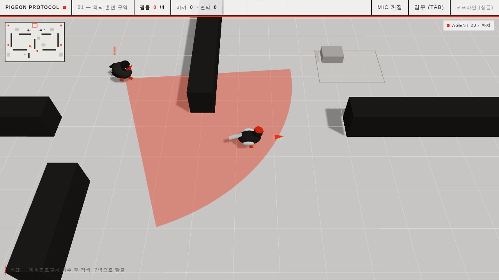

# 스크린샷 가이드

《PIGEON PROTOCOL — 비둘기 특무》의 주요 화면 모음. 이미지는 `docs/img/`에 있으며,
헤드리스 브라우저(Chromium + WebGL)로 캡처했다. Archivo 웹폰트는 캡처 환경에서
시스템 폰트로 대체되므로, 실제 배포 시에는 타이포그래피가 더 선명하게 나온다.

## 타이틀


요원 3종(비둘기·까치·부엉이), 난이도 3단계, **스테이지 선택**(클리어 시 해제 ·
최고 랭크 표시), 설정(경비 시야콘 토글 · 카메라 거리), 신원(콜사인 · 방 코드)까지
한 패널에서 고른다. 선택값은 브라우저에 저장되어 다음 접속 시 유지된다.

## 잠입 (게임플레이)


전서구 요원의 절차적 애니메이션, 잉크 벽과 그림자, 그리드 바닥. 좌상단 **미니맵**은
벽·은폐·필름·아이템·탈출구·경비(상태별 색)·참가자·플레이어를 실시간으로 그린다.
바닥의 **적색 화살표**는 가장 가까운 미회수 필름(전부 회수 시 탈출구) 방향을 가리킨다.

## 임무 파일 (Tab)


작전 브리핑, 필름 체크리스트와 탈출구 상태, 장비 보유량, 요원 정보, 참가자 목록을
우측 드로어에서 확인한다. `Tab` 또는 `M`으로 토글.

## 요원 선택


까치(속도형)는 검은 몸통에 긴 꼬리로 외형이 구별된다. 어려움 난이도라 시작 장비가
없다(미끼 0 · 연막 0). 요원마다 이동 속도 · 피탐지도 · 대시 재사용이 다르다.

## 경비 AI — 발각·추격



경비의 시야콘에 들어가 감지 게이지가 가득 차면(상단 적색 바) `!` 표식과 함께 추격이
시작된다. 경비는 이제 **A\* 길찾기로 벽을 돌아** 플레이어를 쫓고(개활지에선 직진),
놓치면 마지막 목격 지점을 수색한다. 이 장면은 헤드리스 브라우저로 실제 추격을 유발해
캡처했다.

---

## 캡처 재현

```bash
pnpm build
pnpm preview --port 4173        # 로컬 서버
# 다른 터미널에서 스크린샷 스크립트를 실행 (Playwright 등)
```

스크린샷은 1280×720(2×) / 타이틀은 1180×1040 뷰포트로 캡처했다.
